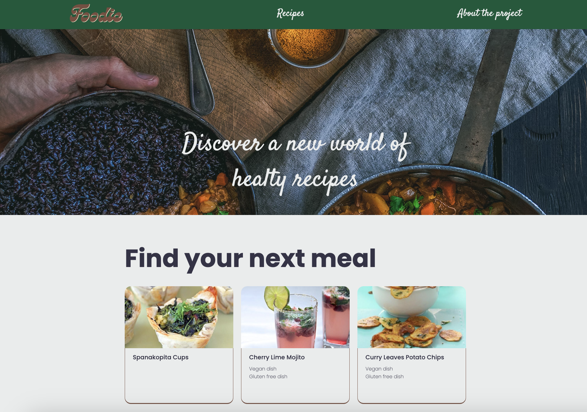

# Vegetarian cuisine

Discover new vegetarian and vegan recipes everyday! We have houndreds of healthy and delicious recipes from various cuisine, and you can display only the ones you are interested in. We also have a selector to only show gluten-free recipes AND one for vegan recipes, come and discover your next meal!
 
 
Try the website <a href= "https://foodie-veggie.netlify.app/recipes">here</a>.
 
Or continue reading about the project <a href= "#the-project">here</a>.

    
Index

    <ol>
        <li>
            <a href="#the-project">The Project</a>
            <ul>
                <li><a href="#prerequisite">Prerequisite</a></li>
                <li><a href="#technical-requisite">Technical requisite</a></li>
            </ul>
        </li>
        <!-- -->
        <li>
            <a href="#design-inspiration">Design inspiration</a>
        </li>
        <!--  -->
        <li>
            <a href="#coding">Coding</a>
            <ul>
                <li><a href="#languages">Languages</a></li>
                <li><a href="#libraries">Libraries</a></li>
                <li><a href="#bundler">Bundler</a></li>
                <li><a href="#free-api">Free API</a></li>
            </ul>
        </li>
        <!--  -->
        <li>
            <a href="#download-it-yourself">Download it yourself</a>
            <ul>
                <li><a href="#git-clone">Git Clone</a></li>
                <li><a href="#install">Install</a></li>
                <li><a href="#npm-build">Npm build</a></li>
                <li><a href="#open-the-project">Open the project</a></li>
            </ul>
        </li>
        <!-- -->
        <li>
            <a href="#a-quick-guide-to-use">A quick guide to use</a>
            <ul>
                <li><a href="#search-for-the-city">Search for the city</a></li>
                <li><a href="#press-search-button-and-done">Press search button and... Done!</a></li>
            </ul>
        </li>
        <!--  -->
        <li><a href="#contacts">Contacts</a></li>
    </ol>

## The project

This project is part of my journey in learning to code with [Start2Impact University](https://www.start2impact.it). This is my project to prove my knowledge about React.
 
Created in 2024.

### Prerequisite

The assignment for this project was to built a website for vegetarian people to help them find new recipes. It was required a searchbar to find only the vegetarian recipes in the API, and clicking on the single recipe will open a new page with information about the specific dish.
 
All the information were provided by [Spoonacular API](https://spoonacular.com/food-api/docs).

### Technical requisite

- Using React
- Implementing a searchbar which search in all vegetarian recipes, and only them. You needed to read carefully the documentation of the API
- Every recipe needs to show name and image of the dish
- every recipe in clickable and redirect to a specific page where you can see more details about that dish
- Responsive designe
- Organized project structure
- UX and UI easy to use
- Write a README file

Every addictional feature is welcome, especially:

- React Redux
- React Hooks
- Axios
- React Router
- Context API

<a href="#top">return to the top</a>

## Design inspiration

I'm not a good graphic designer, so part of my preparatory work consist of search for inspirational works. For this project i have 2 main source:

- The work of a colleage in the Start2Impact University course you can see [here](https://github.com/cristopherturazza/S2I-JS-Advanced/tree/main#best-cities-to-live-house_with_garden) by clicking the link in the readme file. I really like the clear design of it, expecially the upper part of the website with the city photo.
- It was a pure coincidence, but soon after I had seen my colleague project I visited the [Teleport](https://developers.teleport.org/api/) website to examine the API information. I noticed the structure of the two website were similar, but i liked more the subdivision of the spaces in two column of teleport website.

<a href="#top">return to the top</a>

## Coding

To developed this website I used:

### Languages

- HTML
- CSS
- [Bootstrap 5](https://getbootstrap.com)
- [SASS](https://sass-lang.com)
- JavaScript

### Libraries

- [Lodash](https://lodash.com/docs/4.17.15#get)
- [Axios](https://axios-http.com/)

### Bundler

- [Webpack 5](https://webpack.js.org/)

### Free API

- [Teleport](https://developers.teleport.org/api/)

<a href="#top">return to the top</a>

## Download it yourself

The first thing you need is Node.js installed, if you haven't please check [this](https://nodejs.org/it/download/) page.
After the installation open the terminal in your computer and make sure you are in the folder you want to download the project in.

### Git clone

Type in the terminal
`git clone https://github.com/francesca-pizzighini/find-your-city.git`
Then open the project folder in your code editor and make sure the terminal is now indicating this folder.

### Install

Type in the terminal
`npm i `
to install all the dependencies indicated in the package.json file

### Npm build

Type in the terminal
`npm run build`

### Open the project

Now you have two choices:

- open manually the website by double clicking the index.html file in the dist folder
- type in the terminal `npm run dev`

 
<a href="#top">return to the top</a>

## A quick guide to use

The website is really simple to use, but I'll illustrate an example to make the situation even clearer. 
First of all open the website [here](https://find-your-dream-city.netlify.app).

### Search for the city

In the upper part of the website you'll se a search-bar, simply type the name of the city you want to know more about.

For the sake of this example we'll search for Edinburgh.
Don't worry about making typos, the autocomplete system is here to help you. Just click on the name of the city when it'll show up.

### Press search button and... Done!

Once the name is fully written in the searchbar press the search button and you'll see the result, easy and quick!
Let's take a look at our result for completeness.
In the upper part of the screen you'll see an image of the city you've searched.

Lowering the gaze you can see a description box with city name, the country it belongs to and a brief description of the city.

At the left of the screen you can also see a bunch of scores (like the one in photo) useful to evaluate the city. The result is rounded up to the nearest number in a scale from 1 to 10.

And that's it, you can obtain this data for every city in the database.

<a href="#top">return to the top</a>

## Contacts

If you are intrested you can see all my works on my <a href= "https://francesca-pizzighini.github.io/Portfolio/projects.html">portfolio</a>, or you can visit my GitHub Repository [here](https://github.com/francesca-pizzighini).

Feel free to contact me if you have any question/curiosity about my work. You can do it through my <a href= "https://www.linkedin.com/in/francesca-pizzighini-20b4061b0">LinkedIn Profile</a> or in the contact page of my portfolio [here](https://francesca-pizzighini.github.io/Portfolio/contacts.html).

<a href="#top">return to the top</a>

